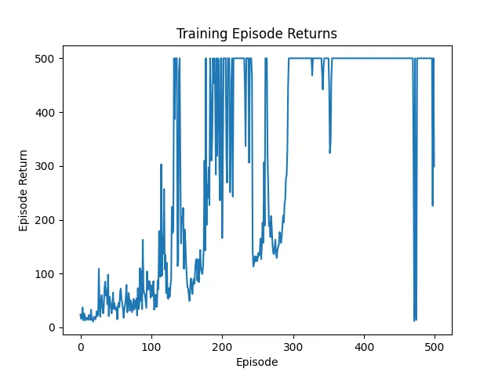
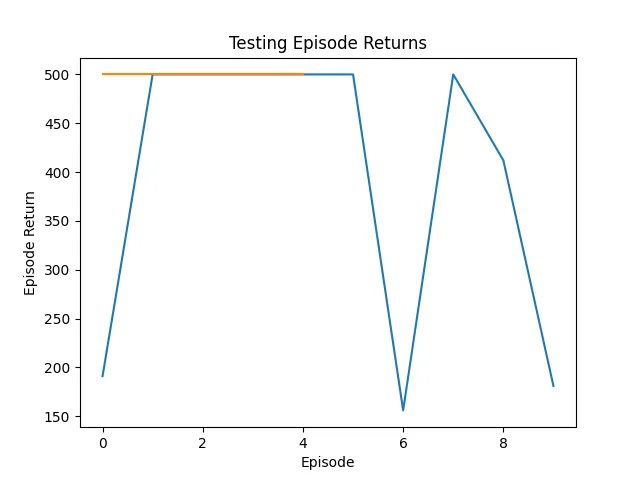

# REINFORCE Algorithm Explained

# REINFORCE

REINFORCE is a **Monte Carlo Policy Gradient** method used in Reinforcement Learning. It is one of the simplest policy gradient algorithms.

- Try random actions from the policy.

- If an action leads to high total reward, we increase the chance of 
choosing it again.

🧪 No Q-values, no Bellman equation — just learning directly from the rewards.

## 🎯 Objective

The goal is to **maximize the expected return**:
$$
J(\theta) = \mathbb{E}_{\tau \sim \pi_\theta}[R(\tau)]
$$

Where:
- $ \theta $ are the parameters of the policy (a neural net) $ \pi_\theta(a|s) $
- $ \tau $ : a trajectory of states and actions
- $ R $ : The total return from a trajectory $ \tau $

## 📈 REINFORCE Gradient

The policy gradient is:
$$
\nabla_\theta J(\theta) = \mathbb{E}_{\pi_\theta}\left[ \nabla_\theta \log \pi_\theta(a|s) \cdot R_t \right]
$$

In practice, we estimate this using sampled trajectories:
$$
\theta \leftarrow \theta + \alpha \cdot \nabla_\theta \log \pi_\theta(a|s) \cdot R_t
$$

## 🧾 Algorithm Steps

1. Initialize policy parameters $ \theta $
2. For each episode:
   - Generate an episode: $ s_0, a_0, r_1, ..., s_T $
   - For each step $ t $:
     - Compute return $ R_t = \sum_{k=t}^T r_k $
     - Compute $ \nabla_\theta \log \pi_\theta(a_t|s_t) \cdot R_t $
   - Update $ \theta $ using the average gradient

## 🧱 Baseline (Variance Reduction)

We can subtract a baseline $ b(s_t) $ from $ R_t $ to reduce variance:
$$
\theta \leftarrow \theta + \alpha \cdot \nabla_\theta \log \pi_\theta(a|s) \cdot (R_t - b(s_t))
$$

Common baselines:
- Constant baseline (e.g., average return)
- Value function estimate $ V(s_t) $

## ✅ Advantages

- Conceptually simple
- Works with any differentiable policy

## ⚠️ Disadvantages

- High variance in gradient estimates
- Requires full episode rollouts (on-policy)

## 🔧 PyTorch Implementation
### CartPole-v1

- [Simple CartPole-v1](./CartPole-v1/simple.py)
- [CartPole-v1 with plots, model saving and testing](./CartPole-v1/full.py)

#### Training

#### Testing

## 📚 References

- Sutton, Barto: *Reinforcement Learning: An Introduction*
- Williams, R. J. (1992). *Simple statistical gradient-following algorithms for connectionist RL*

---

Created by OpenAI ChatGPT
Edited by Kadapalla Nithin Kumar
